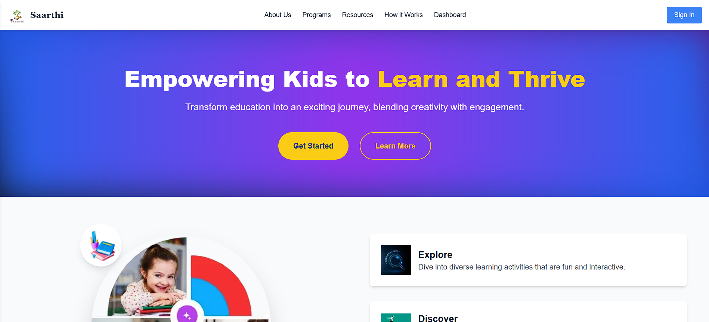
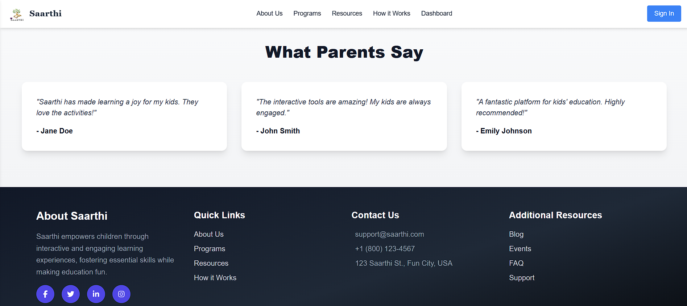
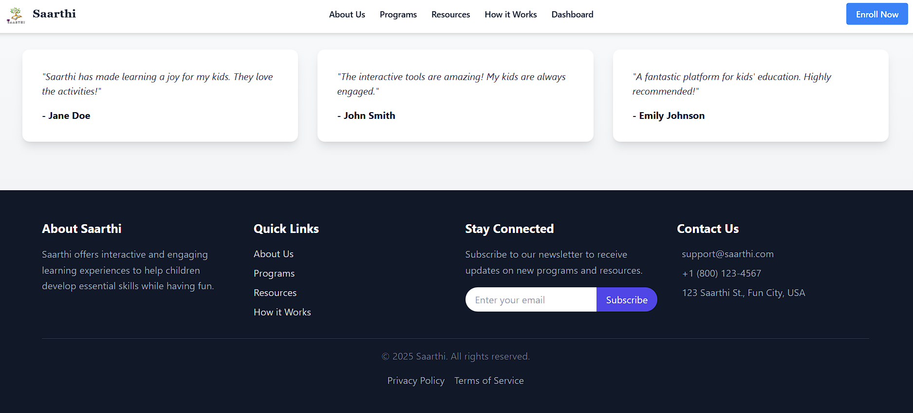
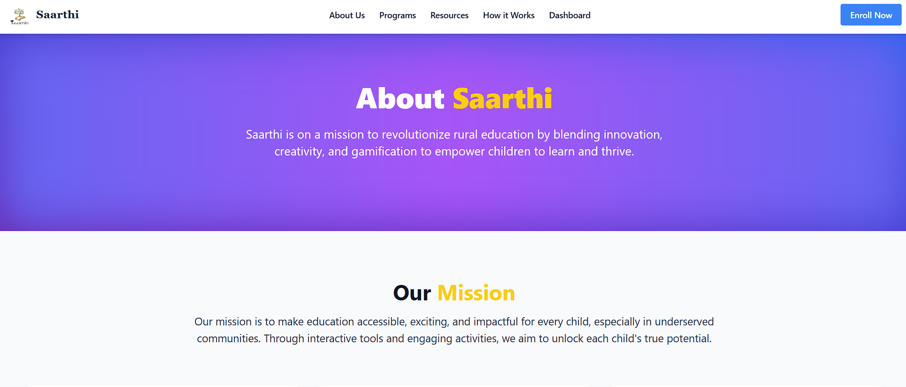
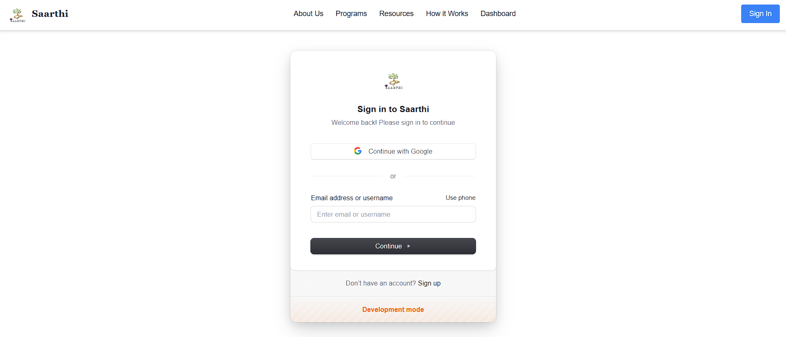
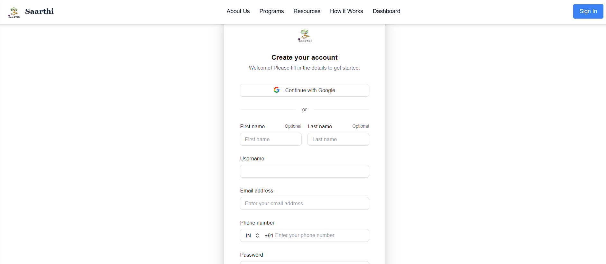
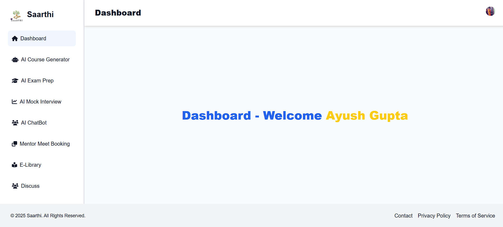

<<<<<<< HEAD
# saarthi---
This is a [Next.js](https://nextjs.org) project bootstrapped with [`create-next-app`](https://github.com/vercel/next.js/tree/canary/packages/create-next-app).

## Getting Started

# Saarthi

A platform dedicated to educating and empowering rural children through engaging and innovative methods.  

🌐 **Website Link**: [https://saarthiedu.vercel.app/](https://saarthiedu.vercel.app/)  

---

## Screenshots  

### Front Page  
  
  
  

### About Page  
  

### Login Page

### Signup Page


### DashBoard

---


## 🚀 Getting Started  

Follow these steps to set up and run the Saarthi project locally.

### Step 1: Clone the Repository  
Clone the repository to your local machine:  
```bash
git clone https://github.com/ayuxsh009/saarthi-latest.git
```  

### Step 2: Navigate to the Project Directory  
```bash
cd saarthi
```  

### Step 3: Install Dependencies  
Install all necessary dependencies to run the project:  
```bash
npm install
```
Or use the shorthand:  
```bash
npm i
```

### Step 4: Start the Development Server  
Run the development server to launch the app locally:  
```bash
npm run dev
```  

Once started, open your browser and navigate to:  
**[http://localhost:3000](http://localhost:3000)**  

---

## 🔧 Build for Production  
To create a production-ready build of the app:  
```bash
npm run build
```  

The production files will be located in the `dist` folder.  

### Preview the Production Build  
To preview the optimized build locally:  
```bash
npm run preview
```  

---


## 🌟 Features  

- **Interactive Frontend**: Built with React and styled for an engaging user experience.  
- **Optimized Performance**: Powered by Vite for faster builds and improved performance.  
- **Focus on Education**: Tailored for rural children with gamified elements.  
- **Responsive Design**: Fully functional on all devices.  

First, run the development server:

```bash
npm run dev
# or
yarn dev
# or
pnpm dev
# or
bun dev
```

Open [http://localhost:3000](http://localhost:3000) with your browser to see the result.

You can start editing the page by modifying `app/page.js`. The page auto-updates as you edit the file.

This project uses [`next/font`](https://nextjs.org/docs/app/building-your-application/optimizing/fonts) to automatically optimize and load [Geist](https://vercel.com/font), a new font family for Vercel.


